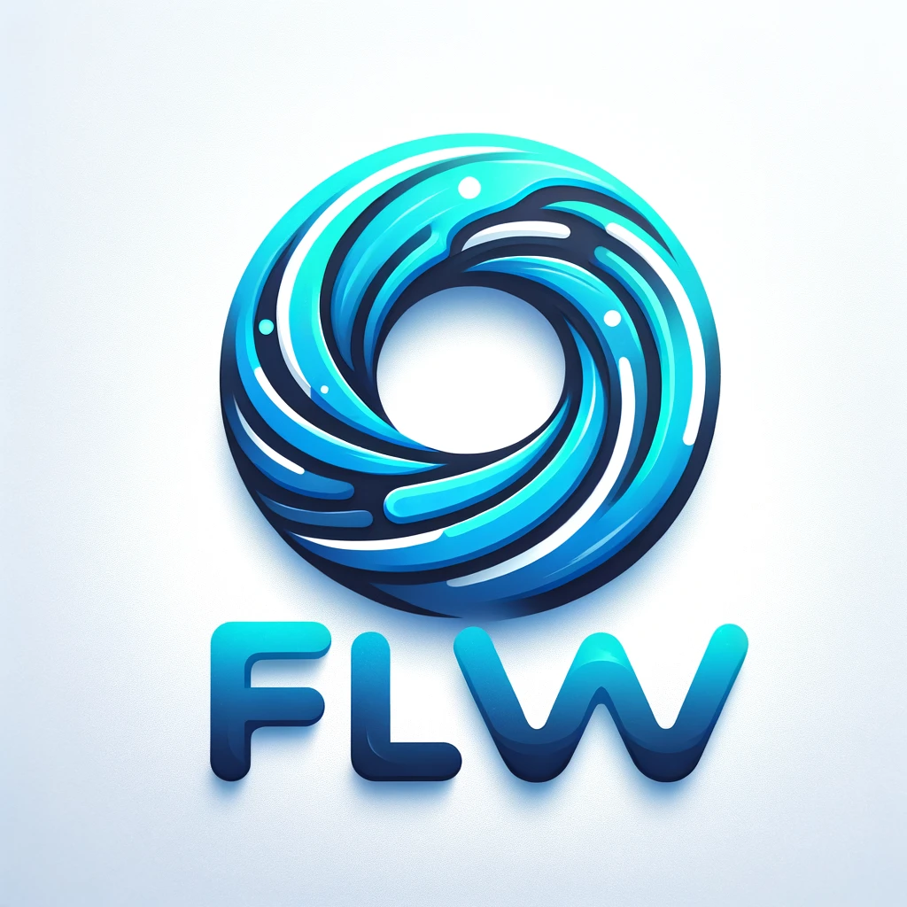

# Flow-JS Framework

<div align="center">
  
</div>

## Overview

Flow-JS is an innovative JavaScript framework tailored for building interactive user interfaces with a strong emphasis on reactivity and state management. It simplifies the creation of complex UI components and ensures that your application remains both performant and scalable.

## Features

- 🔄 **Reactive Data Binding**: Changes in your state automatically reflect in your UI without manual intervention.
- 📦 **Efficient State Management**: Comes with built-in methods for managing global and local states, enhancing the predictability of data flow.
- 🔧 **Advanced Directives**: Supports modern directives such as `:for` for loops, `:if` for conditional rendering, and `@event` for handling events.
- 🛠 **Modular Architecture**: Encourages the use of reusable, modular components that can be easily integrated and tested.

## First Line of Necessary TODOs

1. Allow computed reactive variables to have computed values as their dependencies (multiple level computed properties).
2. Add scoped styling (currently not implemented).
3. Implement the `once` directive to bind events or effects that should only execute once.
4. Use reactive props that bind directly to object properties instead of reading from DOM attributes.
5. Caching the values in loop's expressions.
6. Remove callback hell of component mounting.

## Second Line of TODOs

1. Explore how to handle nested loops effectively.
2. Enhance the system for reactive array updates to ensure minimal DOM manipulation.
3. Cache values inside observers (computed properties) to optimize performance.

## Third Line of TODOs

1. Add support for SCSS to enhance styling capabilities.
2. Introduce TypeScript support for improved development experience and type safety.
3. Implement the `f-model=""` directive for two-way data binding.

## Implemented Features

1. Variable interpolation with `<Paint></Paint>` tags, similar to Vue's `{{ }}` delimiters.
2. Reactive global stores accessed via the `useStore` method.
3. Reactive variables that automatically update the UI when their values change.
4. Event emitting and catching with the `@event` directive.
5. Reactive prop binding with `:prop`.
6. Two-way binding that functions correctly.
7. Application of CSS directly from `component.style.sheet`.
8. `:for` for handling loops within components.
9. Value of type `checkbox` and `text` inputs are now reactive.

## Example Component: Counter

`````javascript
export const Counter = () => ({
  setup(
    props,
    { ref, computed, emit, useStore, watch, onMounted, onBeforeMount }
  ) {
    let counter = ref(1);

    const computedValue = computed(() => {
      return counter.value % 2 === 0 ? "Even." : "Odd.";
    });

    const { cardTitle } = useStore("cardStore");

    const incrementCounter = () => {
      emit("increment", {
        effect: () => {
          counter.value += 1;
        },
      });
    };

    const decrementCounter = () => {
      emit("decrement", {
        effect: () => {
          counter.value -= 1;
        },
      });
    };

    watch(counter, (newValue, oldValue) => {
      if (newValue > 25) {
        alert(
          `Value watched! newValue and oldValue accordingly: ${newValue}, ${oldValue}`
        );
      }
    });

    onMounted(() => {
      console.log("onMounted called.");
    });

    onBeforeMount(() => {
      console.log("onBeforeMount called.");
    });

    const demoTwoWayBinding = () => {
      cardTitle.value = "Two way binding works!";
    };

    const humans = ref([
      {
        name: "Bart",
        age: 21,
      },
      {
        name: "Paul",
        age: 25,
      },
    ]);

    const template = ````html
      <div class="counter">
        <div class="counter-display">Counter: {{ counter }}</div>
        <div class="computed-value">Computed: {{ computedValue }}</div>
        <div style="display: flex; justify-content: space-between; gap: 24px;">
          <button class="btn" @click="incrementCounter">Increment ++</button>
          <button class="btn" @click="decrementCounter">Decrement --</button>
          <button class="btn special" @click="demoTwoWayBinding">
            Demo - two way binding.
          </button>
        </div>

        <Loop
          :for="human of humans.map(e => ({ ...e, status: 'Happy 😊' }))"
          :value="counter"
        >
          <div class="loop-item">
            {{ human.name }} {{ human.age }} {{ human.status }}
            <input :placeholder="counter" />
          </div>
        </Loop>
      </div>
    ````;

    return {
      template,
      counter,
      computedValue,
      cardTitle,
      humans,
      incrementCounter,
      decrementCounter,
      demoTwoWayBinding,
    };
  },
  style: {
    sheet: `
          .counter {
              font-family: 'Arial', sans-serif;
              background: #f8f9fa; /* Light background similar to Bootstrap forms */
              color: #343a40; /* Default Bootstrap text color */
              border: 1px solid #dee2e6; /* Light grey border */
              border-radius: 0.25rem; /* Bootstrap's rounded corners */
              padding: 1rem; /* Consistent padding all around */
              margin-bottom: 0.5rem; /* Margin to separate from other elements */
              box-shadow: 0 0.125rem 0.25rem rgba(0, 0, 0, 0.075); /* Bootstrap-like shadow */
              display: grid;
              gap: 8px;
          }

          .counter-display,
          .computed-value,
          .loop-item { /* Added loop item class for loop styling */
              margin-bottom: 0.5rem; /* Space between elements */
          }

          .btn {
              background-color: #007bff; /* Bootstrap primary button color */
              width: 100%;
              color: white;
              border: none;
              padding: 0.375rem 0.75rem;
              font-size: 1rem;
              border-radius: 0.25rem;
              cursor: pointer;
              transition: color 0.15s ease-in-out, background-color 0.15s ease-in-out,
                          border-color 0.15s ease-in-out, box-shadow 0.15s ease-in-out; /* Smooth transition for hover effects */
          }

          .btn:hover {
              background-color: #0056b3; /* Darker blue on hover */
          }

          .btn.special {
              background-color: #28a745; /* Bootstrap success color for special button */
          }

          .btn.special:hover {
              background-color: #1e7e34; /* Darker green on hover */
          }

          /* Styling for loop items */
          .loop-item {
              display: flex;
              justify-content: space-between; /* Distributes space between name and age */
              padding: 0.375rem 0.75rem; /* Padding similar to buttons */
              border-radius: 0.25rem; /* Rounded corners */
              background: #ffffff; /* White background */
              box-shadow: 0 2px 4px rgba(0, 0, 0, 0.1); /* Soft shadow for depth */
              margin-bottom: 0.25rem; /* Space between each loop item */
          }
        `,
  },
});
`````
